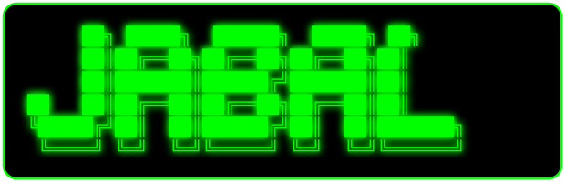

<!-- ASCII BIG HEADER - JABAL (باللون الأخضر - صورة SVG) -->

  

<!-- TYPING EFFECT - HEADER -->

  

<!-- WAVES BANNER (أسود) -->

  

<!-- VISITOR COUNTER (أسود وأخضر) -->

  
  ●

<!-- DIVIDER -->

━━━━━━━━━━━━━━━━━━━━━━━━━━━━━━━━━━━━━━━━━━━━━━━━━━━━━━━━━━━━

<!-- AVATAR + GLITCH EFFECT -->

  

<!-- TYPING EFFECT - NAME -->

  

  <i>"Build what you imagine."</i>

━━━━━━━━━━━━━━━━━━━━━━━━━━━━━━━━━━━━━━━━━━━━━━━━━━━━━━━━━━━━

<!-- BADGES -->

  
  
  
  
  

---

## ⚡ I'm currently working on
**بنك (Banking System)** – بناء نظام بنكي متكامل باستخدام C/C++.

---

<!-- TERMINAL BOX -->
<pre style="background-color: #000000; color: #00FF00; font-family: 'Courier New', monospace; padding: 20px; border: 3px solid #00FF00; border-radius: 10px; box-shadow: 0 0 30px #00FF00, inset 0 0 20px #00FF00;">

root@jabal:~$ whoami

JABAL

> DEVELOPER MODE: ONLINE ┌──────────────────────────────────────────────────────────┐ │                                                          │ │  USER    : Jabal                                        │ │  STATUS  : ONLINE  ●                                    │ │  ROLE    : DEVELOPER                                    │ │  SYSTEM  : ACTIVE                                       │ │  MISSION : BUILD SOMETHING GREAT                        │ │                                                          │ └──────────────────────────────────────────────────────────┘ 

root@jabal:~$ cat about_me.txt

Hello, World! I'm Jabal. I'm a developer and a builder. I enjoy programming, problem solving, understanding how things work, and building things from scratch. This is only the beginning.

root@jabal:~$ languages

[ CURRENT ]
  ├── C
  └── C++

[ FUTURE ]
  ├── ???
  ├── ???
  ├── ???
  └── ???

> More languages will be added as the journey continues.

root@jabal:~$ ./mission

╔══════════════════════════════════════════════════════════╗
║                                                          ║
║  I don't want to know every language.                   ║
║                                                          ║
║  I want to become capable of building                   ║
║  whatever I can imagine.                                ║
║                                                          ║
╚══════════════════════════════════════════════════════════╝

Languages are tools. Knowledge is the weapon. Logic is the foundation. Experience is earned.

root@jabal:~$ exit

> Connection terminated.
> But the journey continues...

</pre>

<!-- GITHUB STATS (خارج الـ pre حتى تشتغل الصور والروابط فعلياً) -->
## 📊 GitHub Stats

  
  

## 📈 Recent Activity

  

## 🔥 Streak

  

## 📬 Connect with me

  

  

<pre style="background-color: #000000; color: #00FF00; font-family: 'Courier New', monospace; padding: 20px; border: 3px solid #00FF00; border-radius: 10px; box-shadow: 0 0 30px #00FF00, inset 0 0 20px #00FF00;">
╔════════════════════════════════════════════╗
║                                            ║
║       J A B A L  //  D E V E L O P E R    ║
║                                            ║
║            C  •  C++                       ║
║                                            ║
║          [ SYSTEM ONLINE ]                 ║
║                                            ║
╚════════════════════════════════════════════╝

> The journey is still being written...
</pre>

<!-- GLITCH TEXT EFFECT (نهاية متحركة) -->

  

━━━━━━━━━━━━━━━━━━━━━━━━━━━━━━━━━━━━━━━━━━━━━━━━━━━━━━━━━━━━

<!-- FOOTER WAVES (أسود) -->

  

